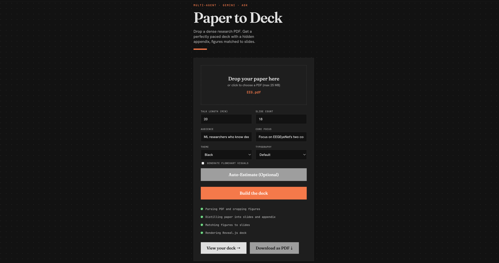
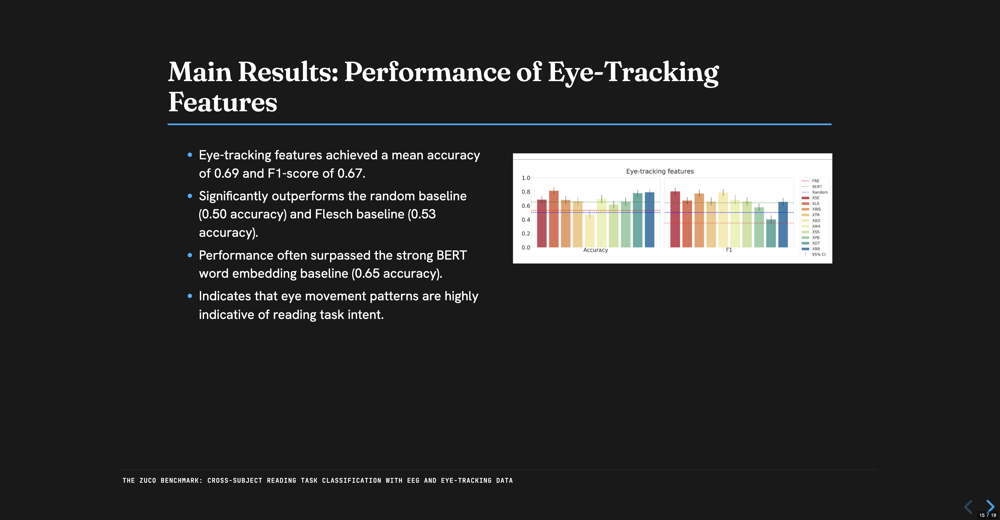
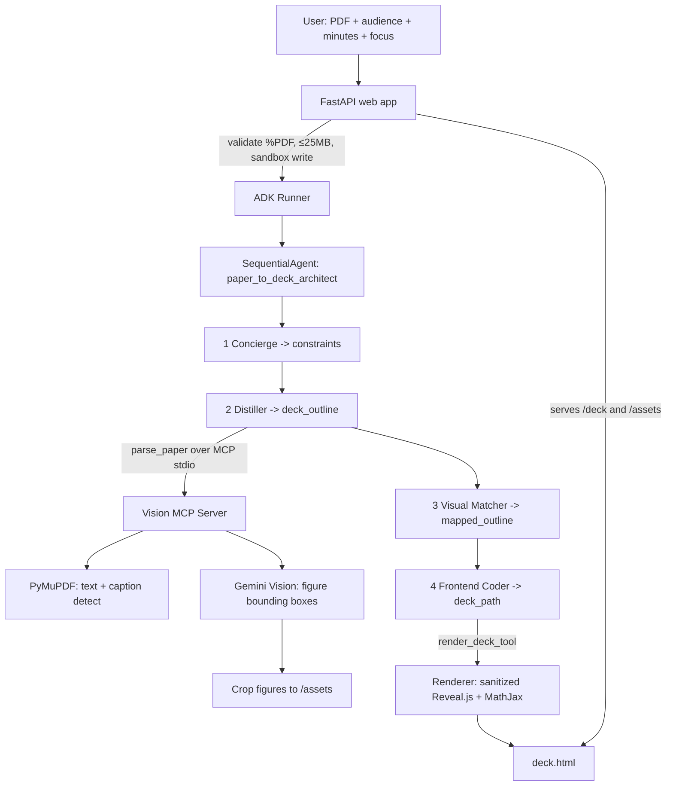

# Paper-to-Deck Architect

> Built for the Kaggle 5-Day AI Agents (Vibe Coding) Capstone.
> Example deck generated from an open-access arXiv paper (citation placeholder).

**Paper-to-Deck Architect instantly transforms dense research PDFs into beautifully formatted, perfectly paced interactive presentation decks for any time constraint, built for all researchers and students drowning in papers.**


<div style="display: flex; justify-content: space-between; gap: 10px;">
  
  
  
</div>

## The Problem

Turning a dense, highly technical academic paper into a custom-length presentation is an arduous, multi-hour process. It requires reading deep derivations, manually snipping figures and tables, restructuring complex arguments into digestible bullet points, and laboriously formatting slides. Students and researchers need a system that does the heavy lifting, respects their exact time constraints, and doesn't hallucinate layout or content.

## Why Agents (not one prompt)

This is a multi-specialist job. To reliably automate this process, the system needs to: physically extract figures, decide on an outline constrained by time limits, intelligently match figures to the correct slides by understanding context, and safely render deterministic UI code. Each of these is a distinct competency, which is why they are broken down into a team of specialized agents, mapping directly to the Google ADK's `SequentialAgent`.

## Architecture



The FastAPI backend routes the sanitized PDF and constraints to the ADK `SequentialAgent`. State flows cleanly downstream from agent to agent, tapping into a low-level MCP server for vision tasks before culminating in a secure, deterministic HTML rendering phase.

## The Agent Pipeline

- **Concierge Agent (`output_key="constraints"`):** Interviews the user (or parses form inputs) to establish rigid constraints for the presentation, including the exact talk duration in minutes, the target audience, and the core focus.
- **Distiller Agent (`output_key="deck_outline"`):** Calls the MCP `parse_paper` tool to read the paper and write a strict outline. It splits the content into exactly the right number of main slides to hit the time budget, moving heavy derivations and secondary graphs into up to 20 "Hidden Appendix" slides. It forces plain-text and unicode math, strictly forbidding raw LaTeX or markdown to protect the rendering engine.
- **Visual Matcher Agent (`output_key="mapped_outline"`):** Reviews the outline against the PyMuPDF figure manifest, assigning each cropped figure to the most appropriate slide using caption context. It never invents paths, relying solely on the real extracted assets.
- **Frontend Coder Agent (`output_key="deck_path"`):** Calls the deterministic `render_deck_tool`. It never writes HTML itself, completely preventing XSS injection and UI hallucination.

## The Vision MCP Server

Our standout technical detail is `mcp_server.py`, which exposes the `parse_paper` tool over stdio to the agents. It uses a hybrid extraction approach: PyMuPDF first pulls the text and detects `Figure/Table N` captions. When a caption exists, the page is rasterized and its main-body text is whited out. Then, **Gemini Vision** analyzes the cleaned image to return precise figure bounding boxes on a 0-1000 normalized scale, which PyMuPDF uses to crop and save the assets to `/assets`. This caption-gated logic saves latency and API costs by only invoking the vision model on pages guaranteed to have figures.

## Security Model

Built with enterprise-grade guardrails:
- **Sandboxed Filesystem:** `safe_join` enforces that every single path resolution stays strictly under the `PAPER_TO_DECK_SANDBOX` root.
- **XSS-Safe Rendering:** All text injected into Reveal.js runs through `escape_text`. Images are validated by `safe_asset_src` to only allow `assets/*.png|jpg|jpeg`.
- **Strict PDF Validation:** Uploads are checked for `%PDF-` magic bytes and restricted to a 25 MB cap to prevent denial-of-service.
- **No API Keys:** Authentication is exclusively handled via Vertex AI and Application Default Credentials.

## Google Cloud + Vertex AI

The `google-genai` client reaches Gemini using `GOOGLE_GENAI_USE_VERTEXAI=TRUE` combined with Application Default Credentials (ADC). This routes all inference through enterprise Vertex AI infrastructure, meaning no static API key is ever stored or transmitted. The system utilizes `gemini-2.5-flash` deployed in `us-central1`.

## Deployability

Deployment is fully containerized using Docker (`deploy/Dockerfile`) and intended for Google Cloud Run. The service is deployed with the `--no-allow-unauthenticated` flag. This prevents public internet access, stopping runaway billing and quota exhaustion dead in its tracks. Check `deploy/cloudrun.md` for fully reproducible deploy documentation.

## Course Concepts Demonstrated

| Concept | Demonstrated In |
| --- | --- |
| **ADK Multi-Agent** | `src/paper_to_deck/agents/pipeline.py` |
| **MCP Server** | `src/paper_to_deck/mcp_server.py` |
| **Security** | `src/paper_to_deck/security.py` |
| **Antigravity** | Built via Antigravity, shown in the submission video |
| **Deployability** | `deploy/cloudrun.md` + Video demo |

## Tech Stack

- **Google ADK (Agent Development Kit):** Orchestrates the `SequentialAgent` pipeline and state routing.
- **Gemini 2.5 Flash (Vertex AI):** Fast, intelligent processing of dense scientific text.
- **MCP (Model Context Protocol):** Provides the standardized tool interface for isolated Python extraction logic.
- **PyMuPDF (`fitz`):** Powers the high-fidelity PDF rasterization and physical asset cropping.
- **Pydantic v2:** Enforces rigid schema validation to prevent LLM hallucinations.
- **FastAPI:** Handles async file uploads and serves the interactive frontend.
- **Reveal.js:** The standard for programmatic, beautiful HTML slide decks.
- **MathJax:** Included in the renderer to handle math display if necessary (though unicode is preferred).
- **uv:** Lightning-fast, deterministic Python package management.
- **Docker / Cloud Run:** Enables secure, scalable, unauthenticated-blocked cloud deployment.

## Quickstart

### Local Installation
```bash
# Clone the repository
git clone https://github.com/your-username/paper-to-deck.git
cd paper-to-deck

# Authenticate with Google Cloud (Vertex AI)
gcloud auth application-default login

# Configure your environment
cp .env.example .env
# Edit .env and ensure GOOGLE_CLOUD_PROJECT is set to your-project-id

# Install dependencies using uv
uv sync

# Run the local server
PAPER_TO_DECK_SANDBOX=/tmp/p2d uv run uvicorn paper_to_deck.web.app:app --reload
```

### Google Cloud Run Deployment
To deploy to Google Cloud Run, execute the following command. The `--no-allow-unauthenticated` flag is required to protect your GCP quota.

```bash
gcloud run deploy paper-to-deck \
  --source . \
  --region us-central1 \
  --project your-project-id \
  --no-allow-unauthenticated \
  --set-env-vars GOOGLE_GENAI_USE_VERTEXAI=TRUE,GOOGLE_CLOUD_PROJECT=your-project-id,GOOGLE_CLOUD_LOCATION=us-central1,GEMINI_MODEL=gemini-2.5-flash
```

## Testing

The system maintains 100% test coverage for its core flows. Run the suite:
```bash
uv run pytest
```
This executes 35 tests covering Pydantic schemas, security boundaries, PDF parsing, MCP server execution, HTML rendering, agent pipelines, deployment artifacts, and the web backend.
